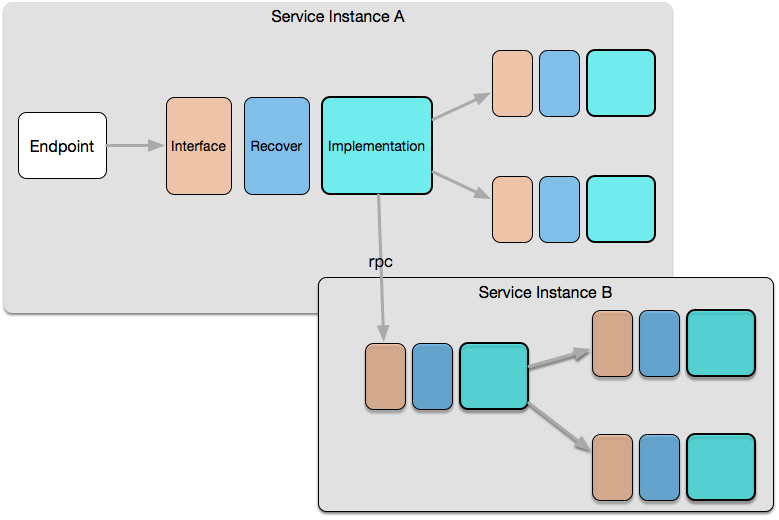

# 如何组织和实现高可用的服务？
* 特定服务放于特定目录
* 特定目录最上层定义服务的：使用接口，公开数据结构
* 特定目录的第一级子目录定义特定服务的不同实现
* 特定服务的实现必须私有
* 特定服务的实现通过New\<ServiceName\>暴露服务定义的接口
* 服务之间只能通过接口实现依赖，即特定服务的实现依赖其他服务的接口
* 特定服务的上层提供一个Recover的接口封装，供使用者选用

---
# 图示

